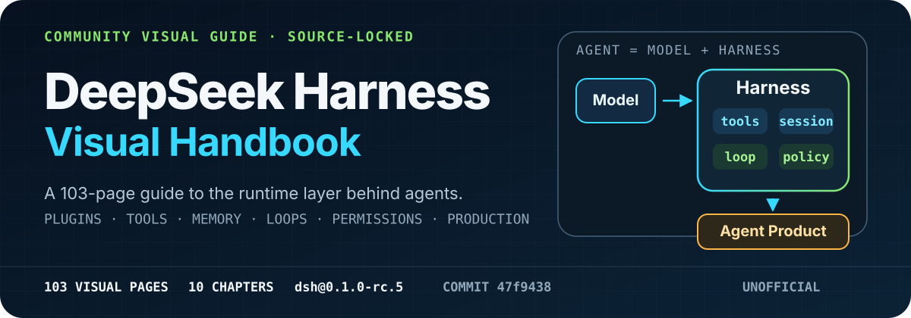
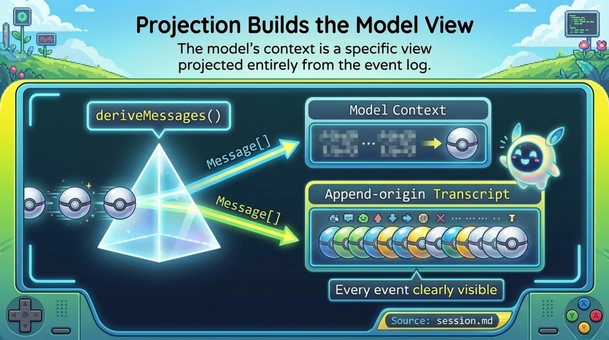
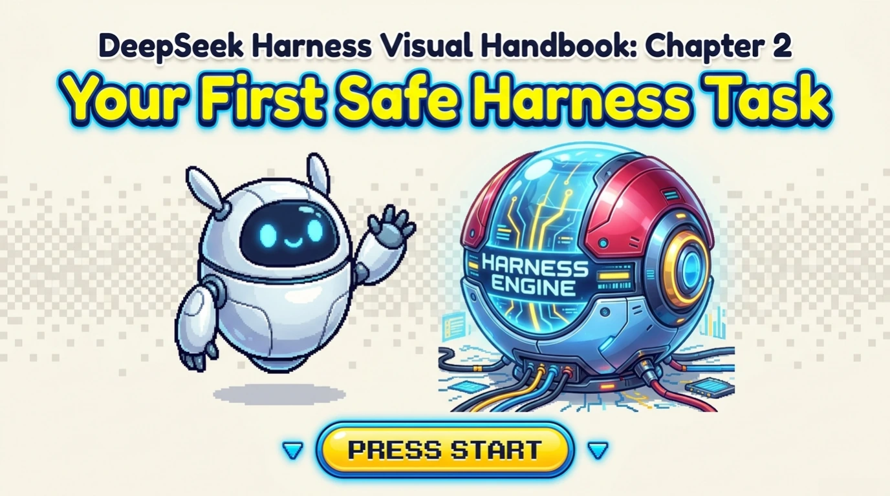
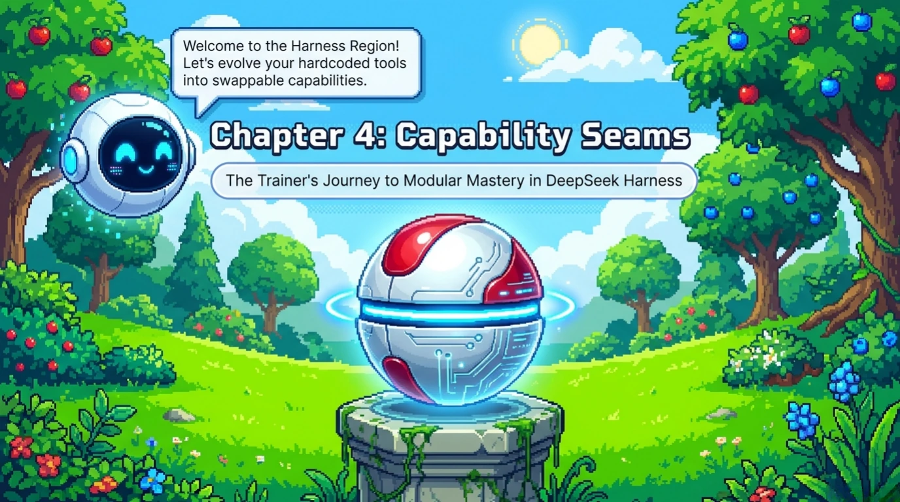
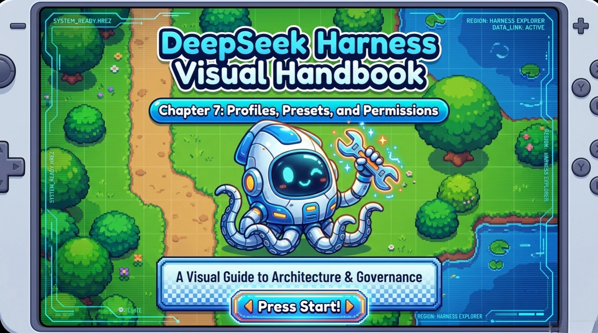
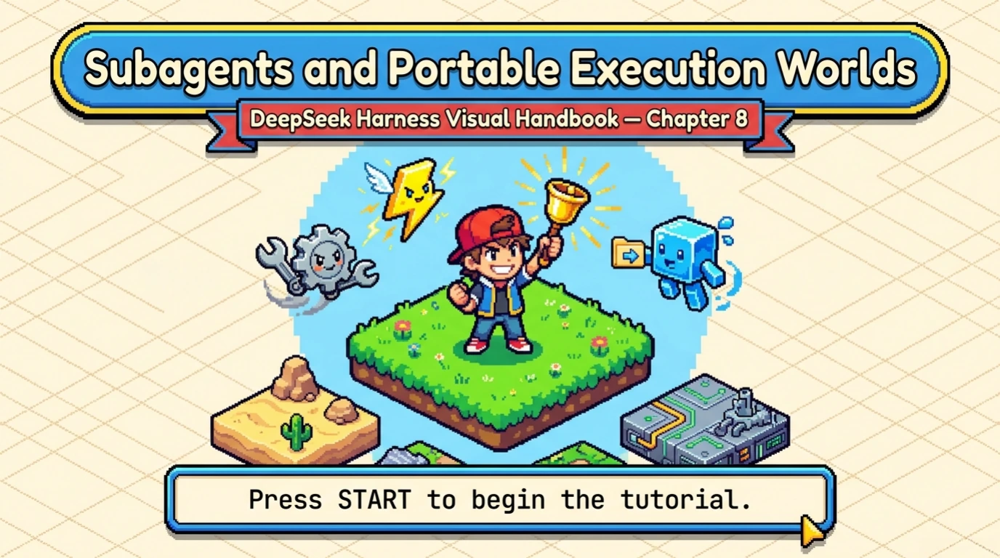
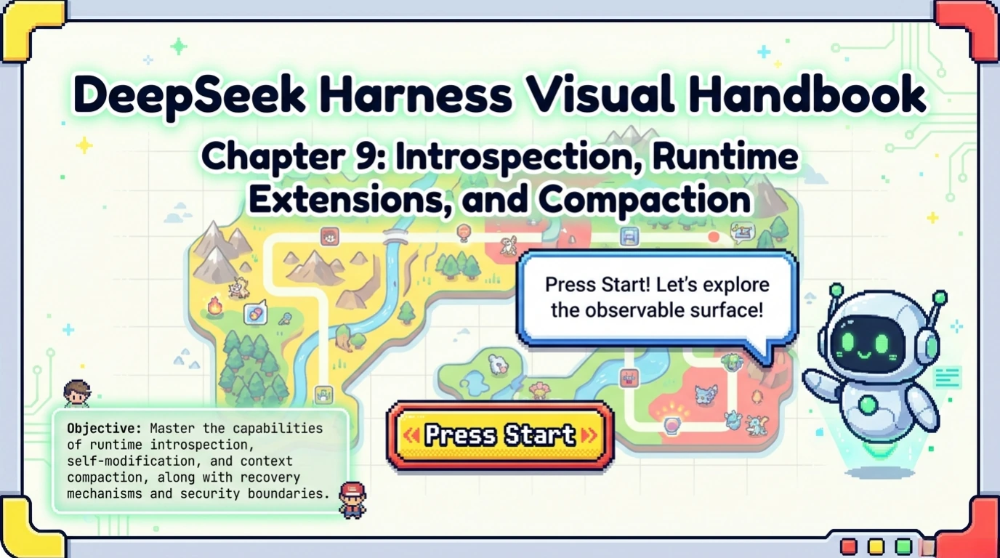
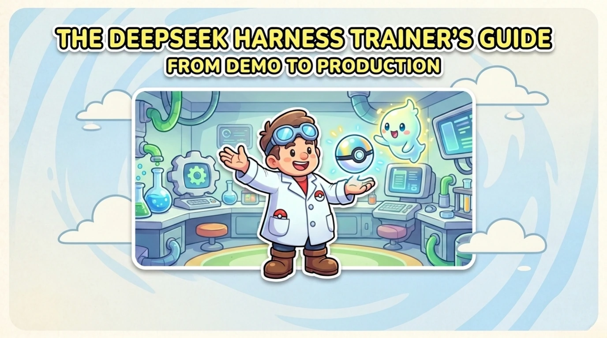

  

  <strong>Understand the runtime layer that turns a model into a working agent.</strong>

  <a href="./chapters/chapter-01.md">Start reading</a> ·
  <a href="./ALL_PAGES.md">Continuous reader</a> ·
  <a href="https://github.com/BeatAPI/deepseek-harness-visual-handbook/releases/latest">Download PDF</a> ·
  <a href="./SOURCES.md">Official sources</a>

> [!IMPORTANT]
> This is an unofficial, community-made visual guide. It is source-locked to DeepSeek Harness commit [`47f9438`](https://github.com/deepseek-ai/deepseek-harness/commit/47f943859bef60e4160492346772ded9b24f765a), which corresponds to the `dsh@0.1.0-rc.5` developer-preview release. The [official repository](https://github.com/deepseek-ai/deepseek-harness) remains the technical source of truth.

## See the ideas before the implementation details

  
  
  

DeepSeek Harness is more than a model wrapper. It composes the model adapter, tool registry, session log, agent loop, permissions, and product entry points as replaceable runtime capabilities. This handbook turns those relationships into a visual learning path instead of duplicating the official documentation as another wall of text.

## Choose a chapter

<table>
  <tr>
    <td width="50%"> <b>01 · The Missing Layer Around the Model</b> 8 pages</td>
    <td width="50%"> <b>02 · Your First Safe Harness Task</b> 10 pages</td>
  </tr>
  <tr>
    <td width="50%"> <b>03 · Everything Is a Plugin</b> 11 pages</td>
    <td width="50%"> <b>04 · Capability Seams</b> 9 pages</td>
  </tr>
  <tr>
    <td width="50%"> <b>05 · Memory Is an Event Log</b> 9 pages</td>
    <td width="50%"> <b>06 · Inside the Agent Loop</b> 12 pages</td>
  </tr>
  <tr>
    <td width="50%"> <b>07 · Profiles, Presets, and Permissions</b> 11 pages</td>
    <td width="50%"> <b>08 · Subagents and Portable Execution Worlds</b> 11 pages</td>
  </tr>
  <tr>
    <td width="50%"> <b>09 · Introspection, Runtime Extensions, and Compaction</b> 11 pages</td>
    <td width="50%"> <b>10 · From Demo to Production</b> 11 pages</td>
  </tr>
</table>

## Pick a reading path

| If you want to... | Read |
| --- | --- |
| Understand why a model is not yet an agent | Chapters [1](./chapters/chapter-01.md)–[2](./chapters/chapter-02.md) |
| Build plugins and replace runtime capabilities | Chapters [3](./chapters/chapter-03.md)–[4](./chapters/chapter-04.md), then [9](./chapters/chapter-09.md) |
| Design memory, execution, and governance | Chapters [5](./chapters/chapter-05.md)–[8](./chapters/chapter-08.md) |
| Move from a demo toward production | [Chapter 10](./chapters/chapter-10.md) |

## Source-locked by design

The reference PDFs that inspired the presentation were used only to study visual storytelling. Technical content comes from the official DeepSeek Harness repository at one immutable commit.

- [Chapter-by-chapter official source map](./SOURCES.md)
- [Locked upstream commit](https://github.com/deepseek-ai/deepseek-harness/commit/47f943859bef60e4160492346772ded9b24f765a)
- [Asset and edition manifest](./manifest.json)
- [Independence, accuracy, and third-party notices](./DISCLAIMER.md)

Source drift should produce a new handbook edition, not a silent rewrite of this one.

## Formats

| Format | Use | Distribution |
| --- | --- | --- |
| WebP | Fast GitHub reading | Versioned in this repository |
| PDF | Complete offline handbook with chapter bookmarks | [GitHub Releases](https://github.com/BeatAPI/deepseek-harness-visual-handbook/releases/latest) |
| PNG | Original-resolution master pages | Maintained outside Git history |

The 103 GitHub reading images total about 16 MiB. The PDF is kept out of Git history so clones stay small.

## Corrections and contributions

Found a technical, text, source, or visual problem? Open a correction issue and include the chapter, page, proposed correction, exact locked upstream source, and verification date. See [CONTRIBUTING.md](./CONTRIBUTING.md).

This project welcomes precise corrections and source-drift reports. It does not accept third-party characters, logos, or visual assets without a compatible license.

## License and acknowledgements

Original handbook text and visual material owned by this project are licensed under [CC BY-SA 4.0](./LICENSE.md). Third-party names, trademarks, and referenced visual elements are excluded from that grant; see [DISCLAIMER.md](./DISCLAIMER.md).

DeepSeek Harness is maintained by DeepSeek and released under its own MIT license. README design methodology was informed by [beautify-github-readme](https://github.com/oil-oil/beautify-github-readme).
