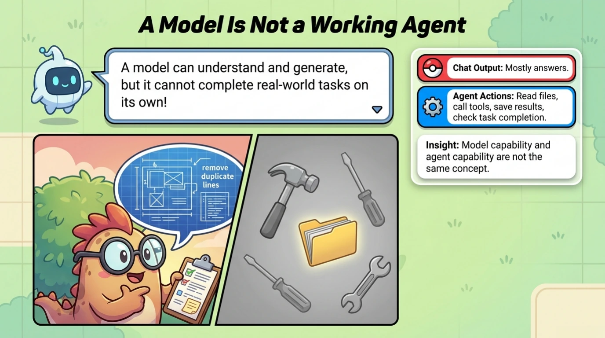
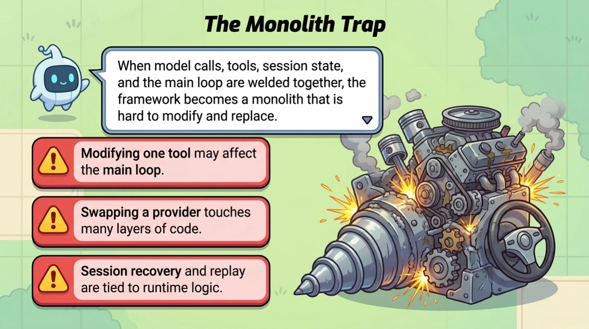
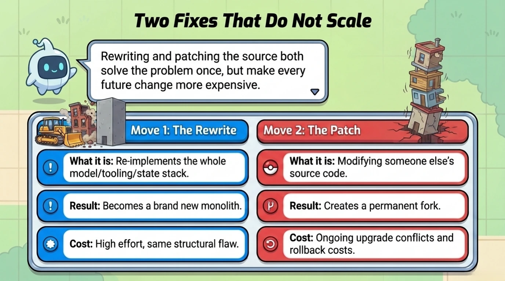
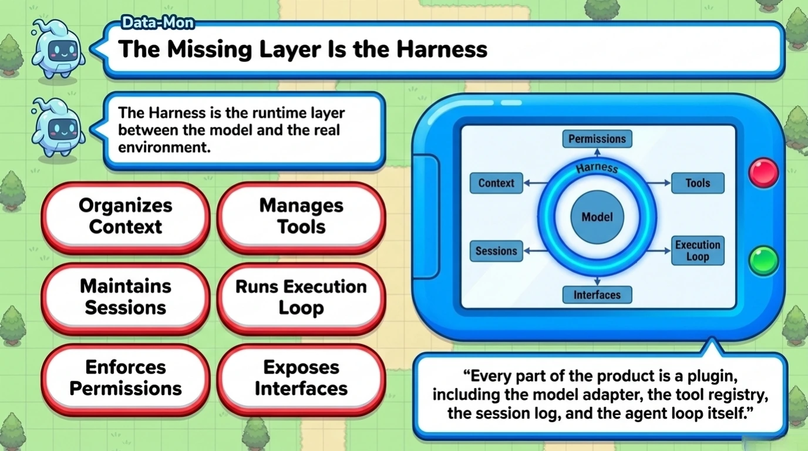
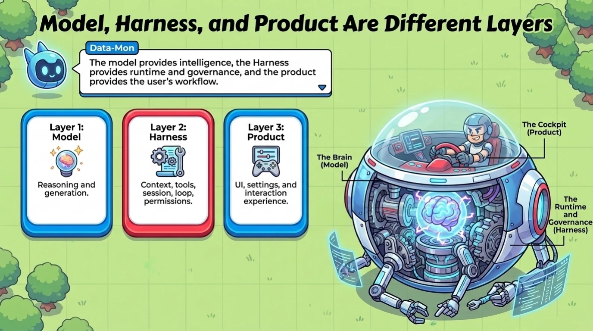
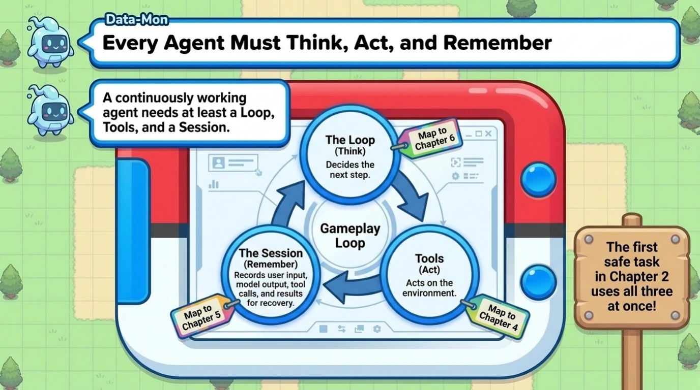
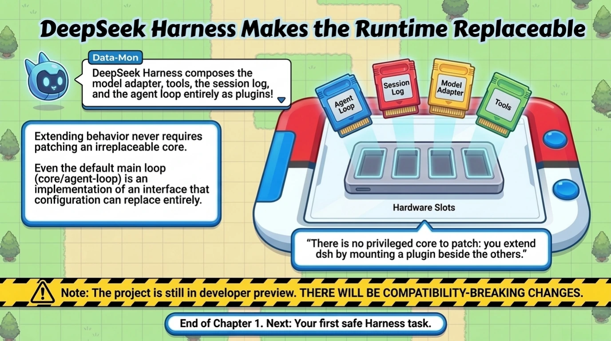

# Chapter 1: The Missing Layer Around the Model

[Back to the handbook index](../README.md)

8 visual pages. [View the locked official source map for this chapter.](../SOURCES.md)

[Handbook index](../README.md) · [Next: Chapter 2 →](chapter-02.md)
