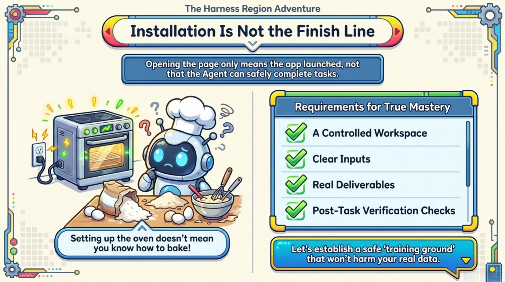
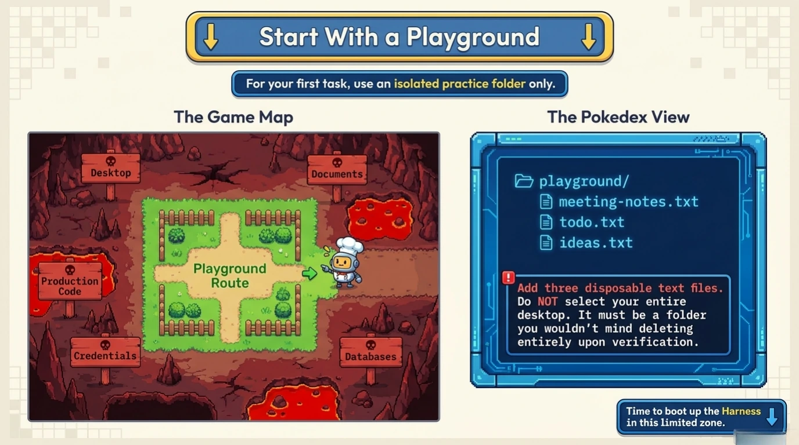
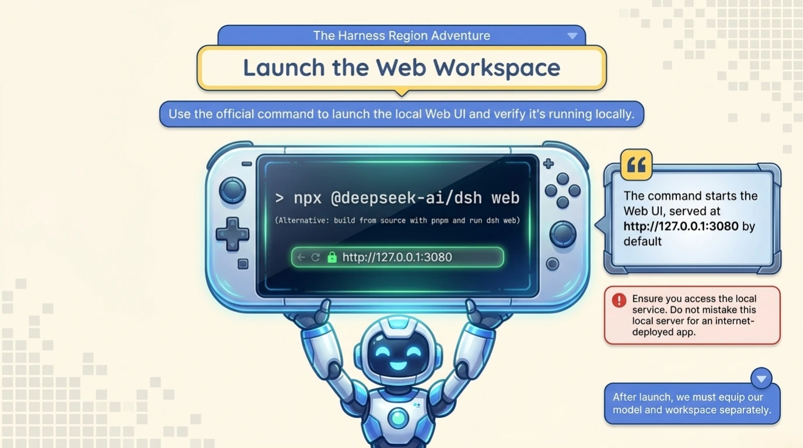
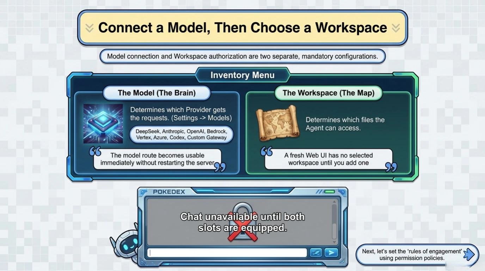
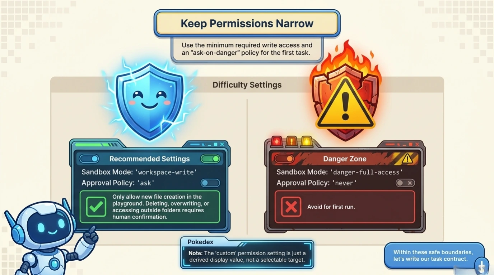
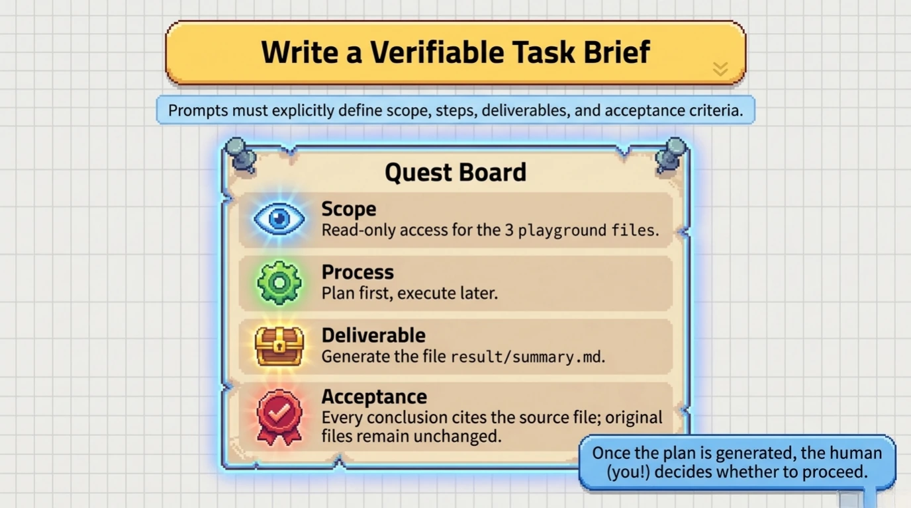
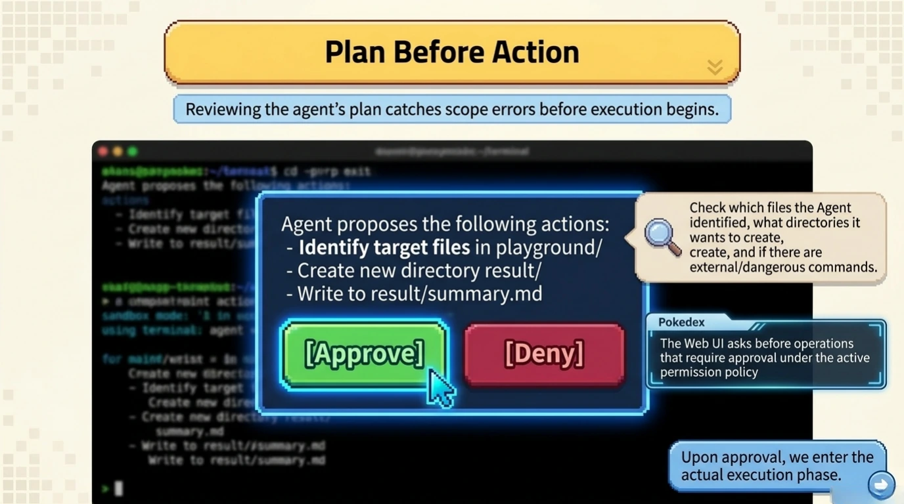
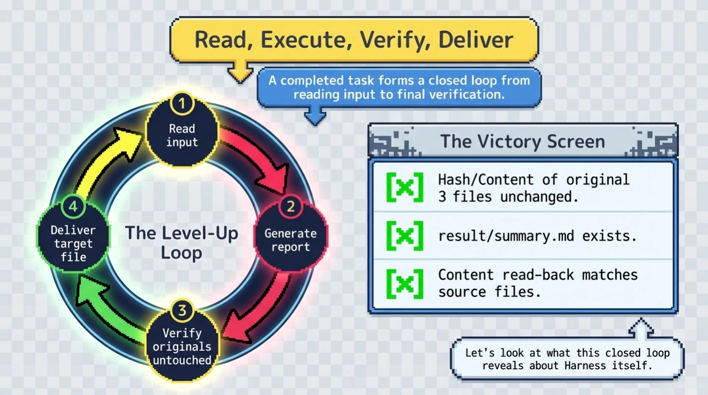
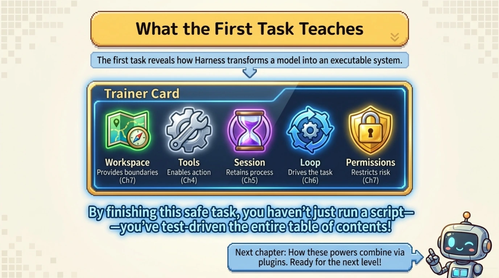

# Chapter 2: Your First Safe Harness Task

[Back to the handbook index](../README.md)

10 visual pages. [View the locked official source map for this chapter.](../SOURCES.md)

[← Previous: Chapter 1](chapter-01.md) · [Handbook index](../README.md) · [Next: Chapter 3 →](chapter-03.md)
