# Chapter 3: Everything Is a Plugin

[Back to the handbook index](../README.md)

11 visual pages. [View the locked official source map for this chapter.](../SOURCES.md)

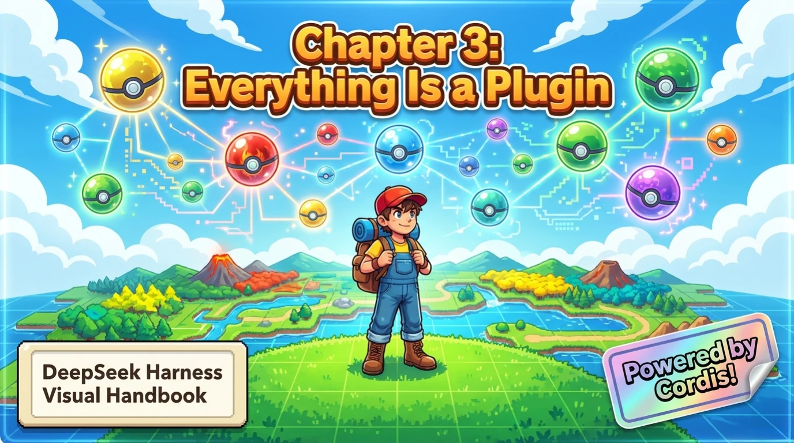

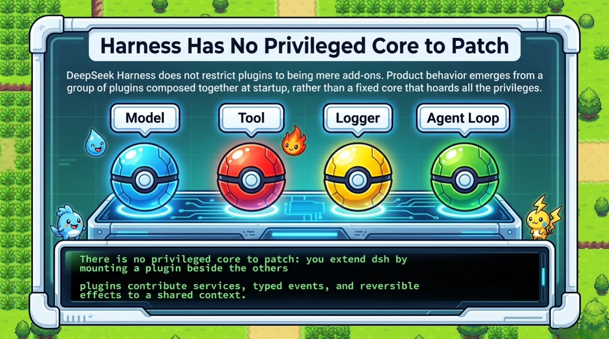

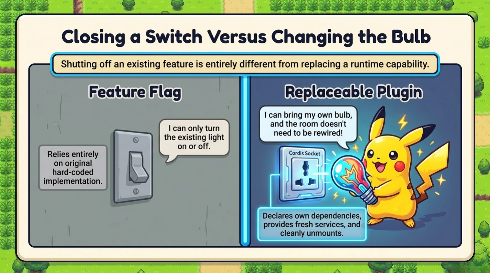

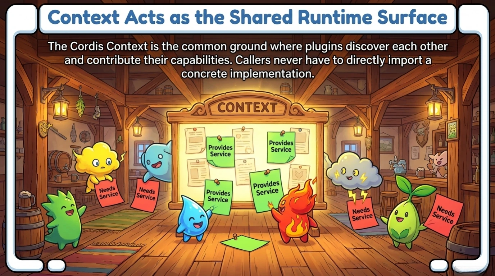

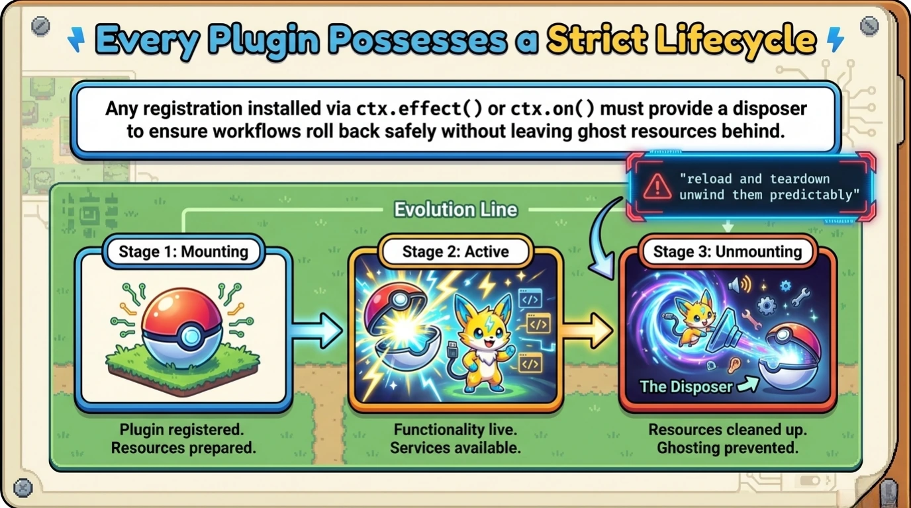

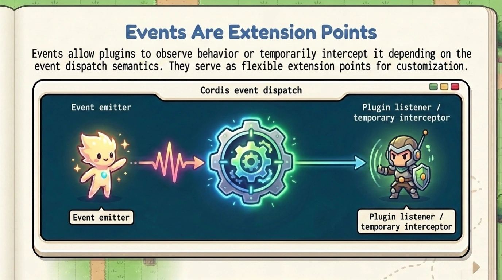

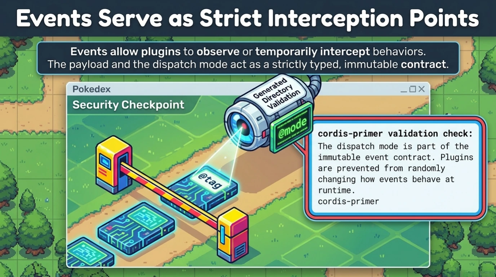

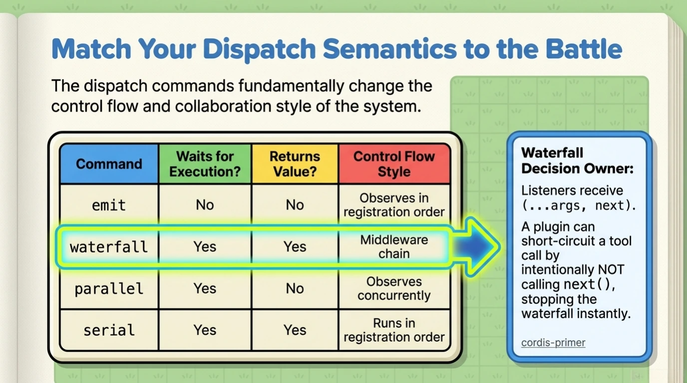

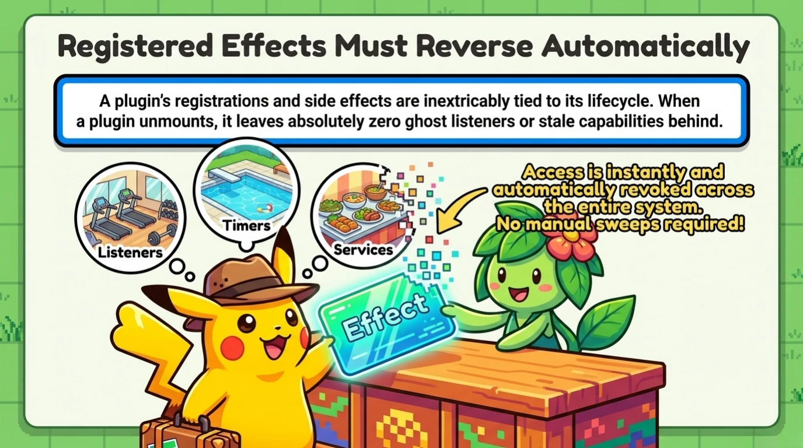

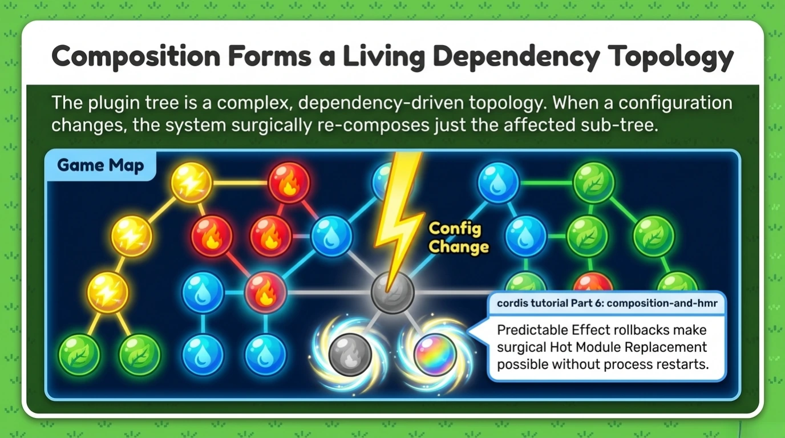

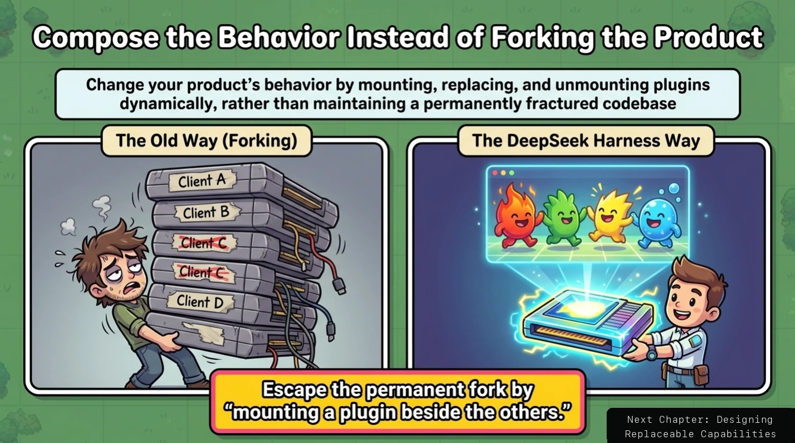

[← Previous: Chapter 2](chapter-02.md) · [Handbook index](../README.md) · [Next: Chapter 4 →](chapter-04.md)
