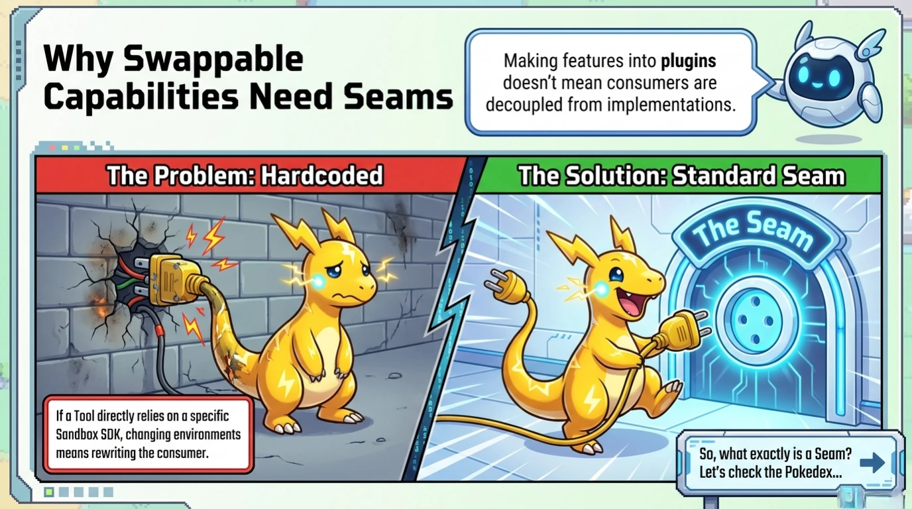
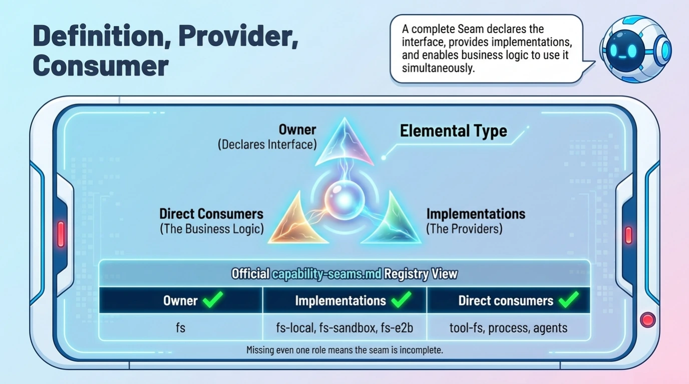
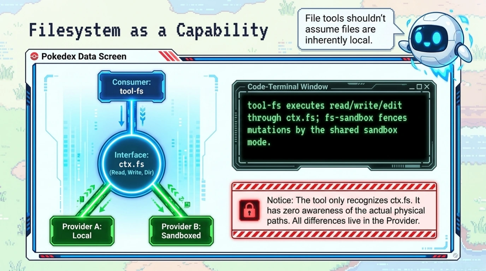
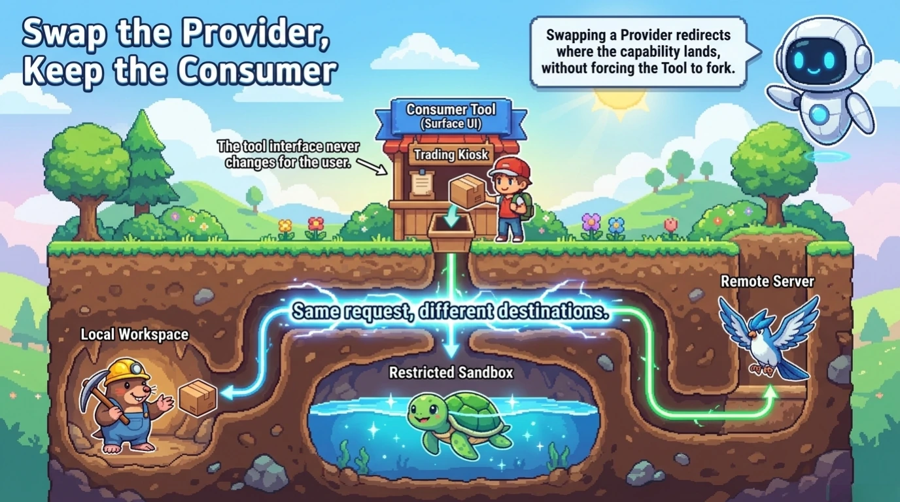
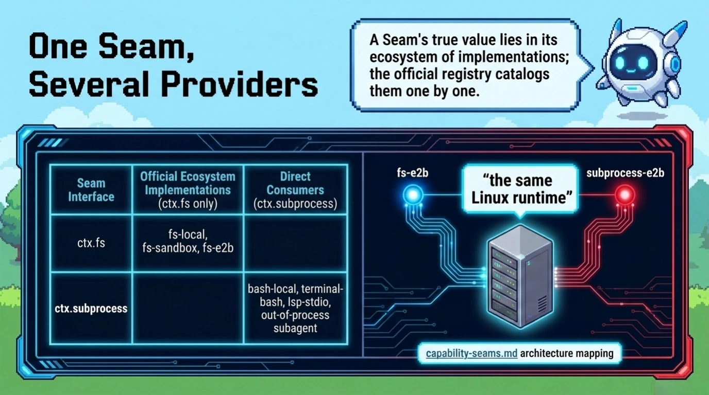
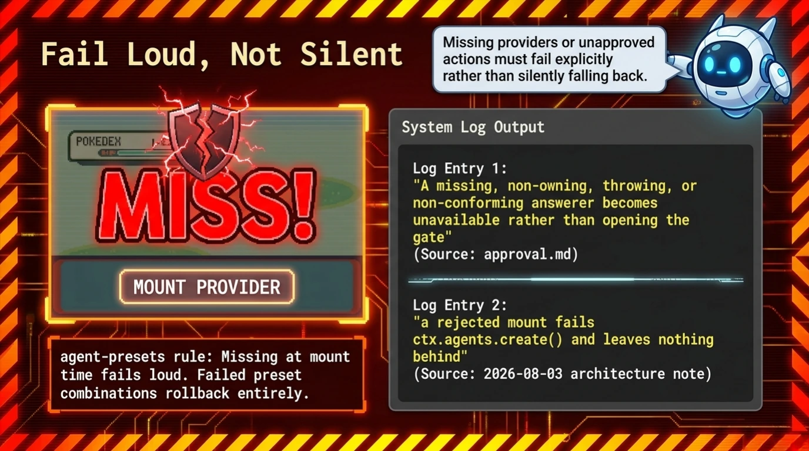
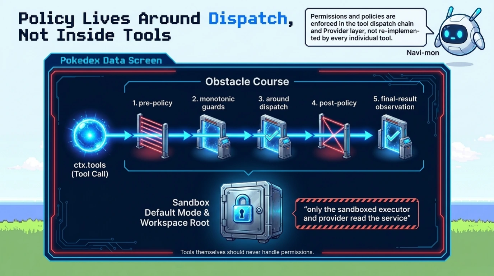
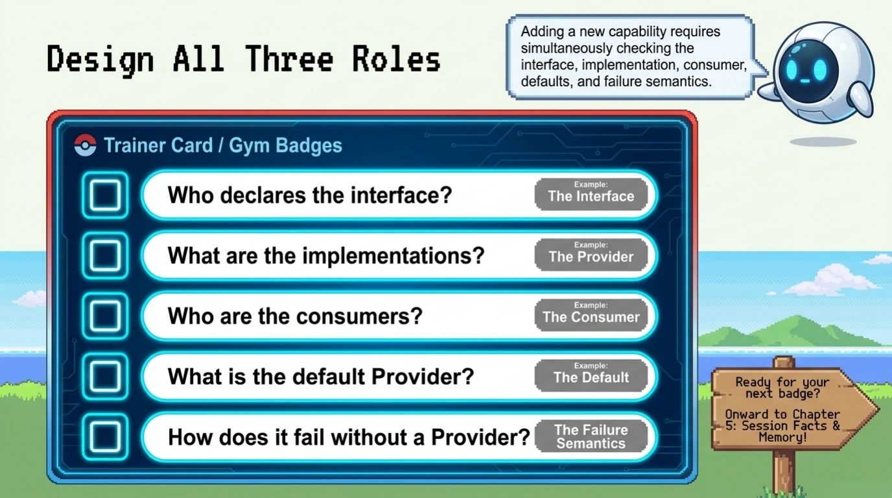

# Chapter 4: Capability Seams

[Back to the handbook index](../README.md)

9 visual pages. [View the locked official source map for this chapter.](../SOURCES.md)

[← Previous: Chapter 3](chapter-03.md) · [Handbook index](../README.md) · [Next: Chapter 5 →](chapter-05.md)
