# Chapter 6: Inside the Agent Loop

[Back to the handbook index](../README.md)

12 visual pages. [View the locked official source map for this chapter.](../SOURCES.md)

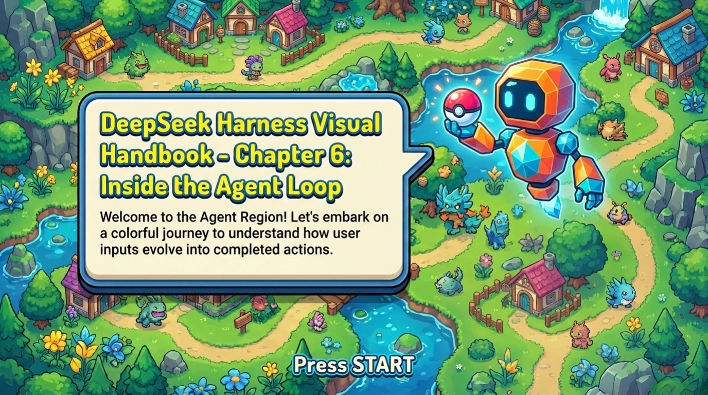

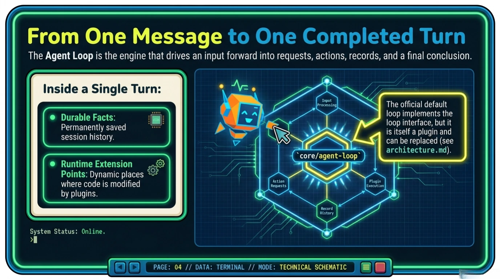

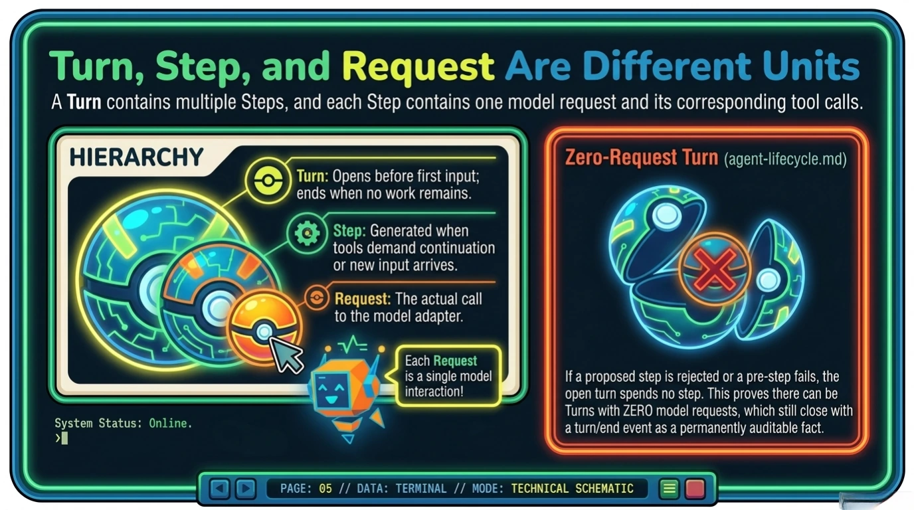

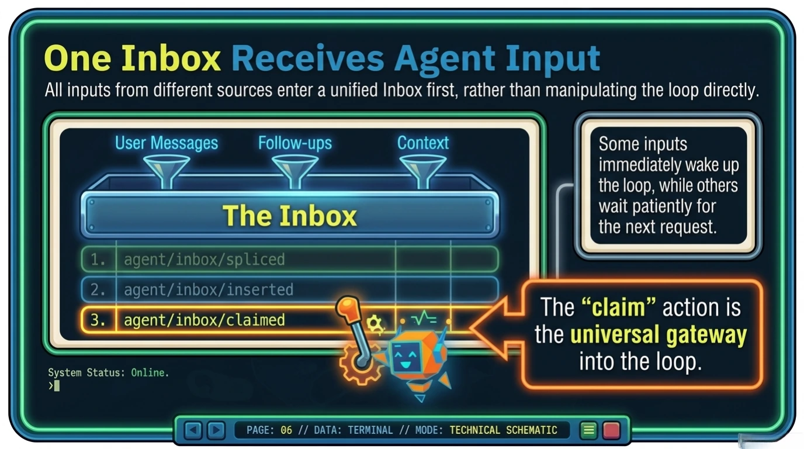

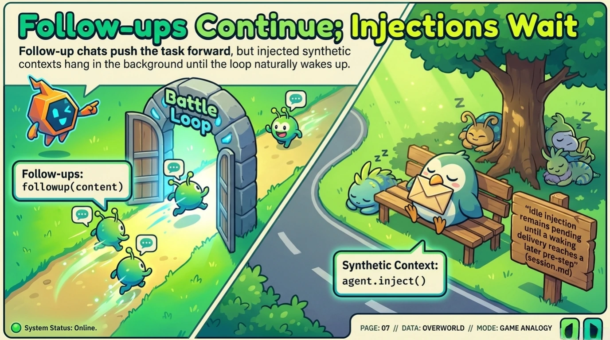

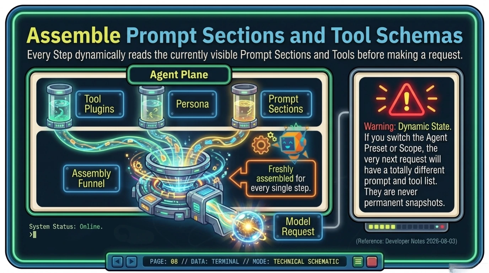

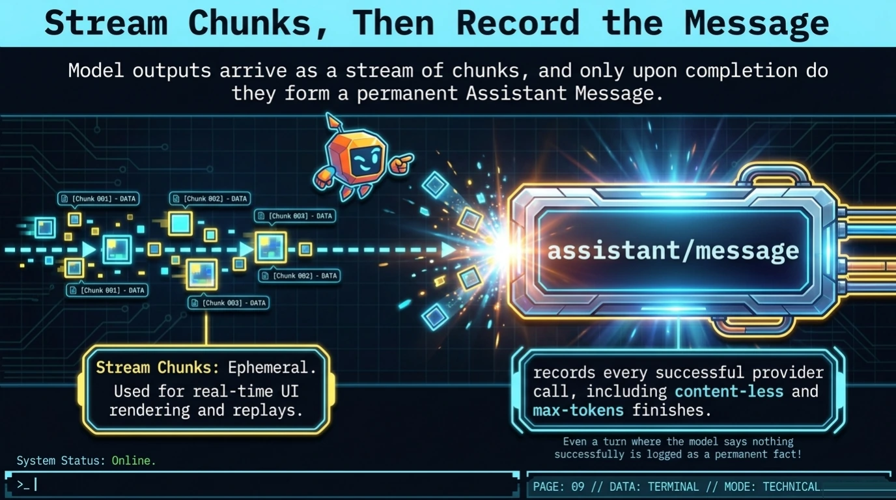

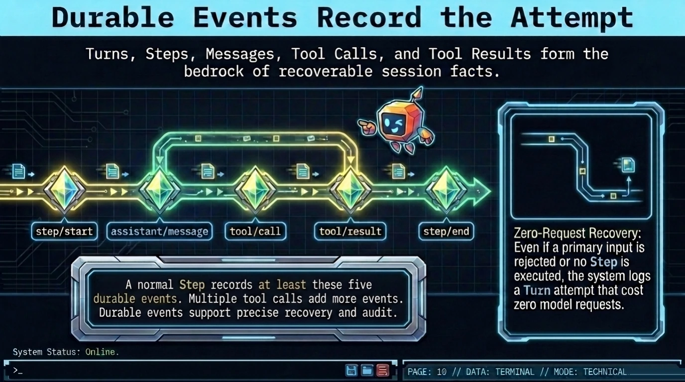

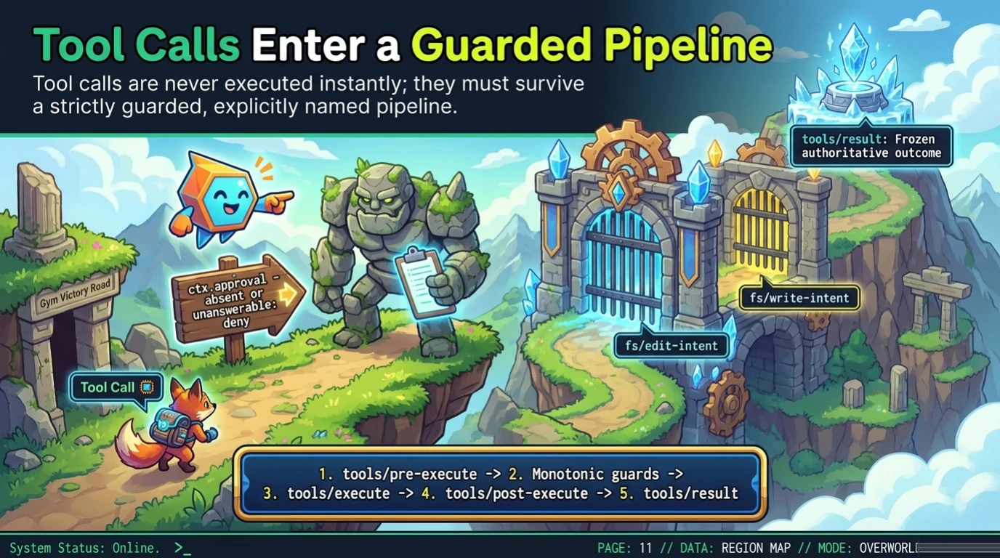

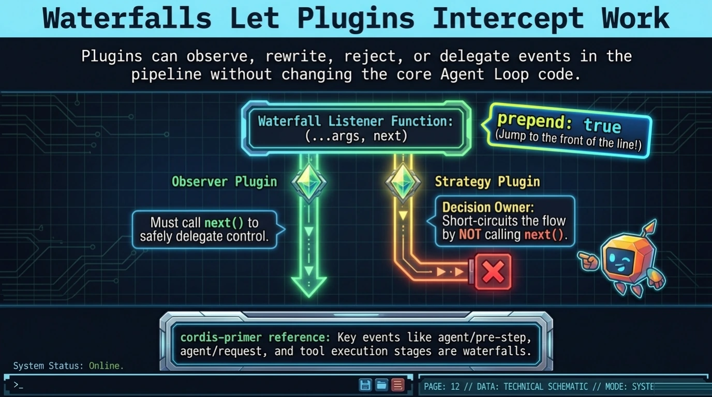

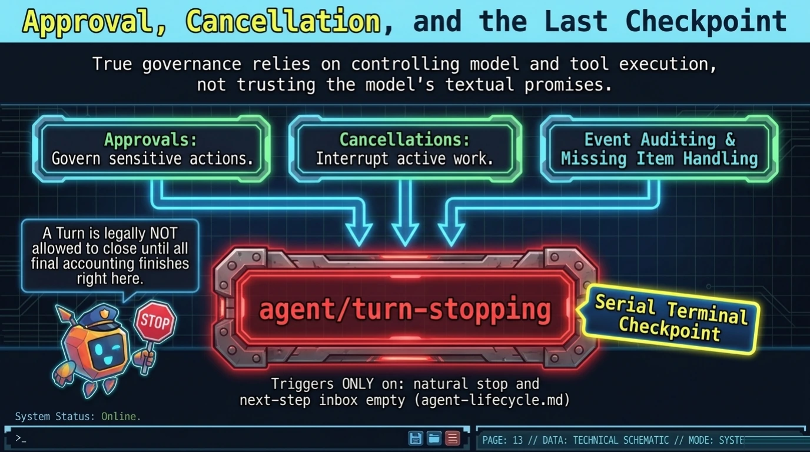

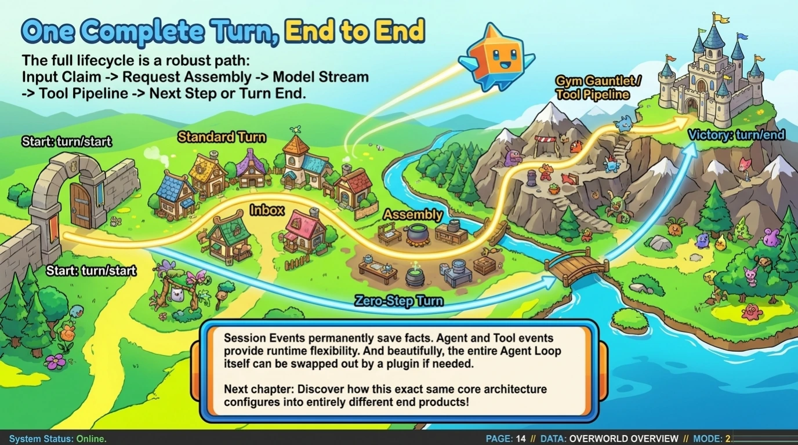

[← Previous: Chapter 5](chapter-05.md) · [Handbook index](../README.md) · [Next: Chapter 7 →](chapter-07.md)
