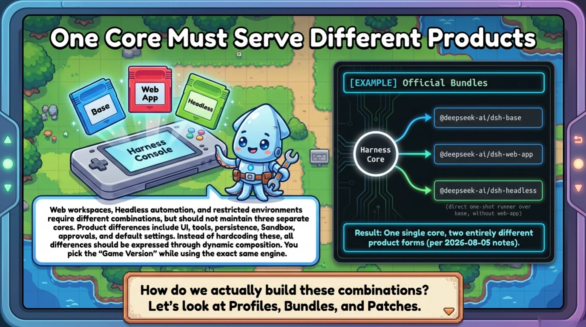
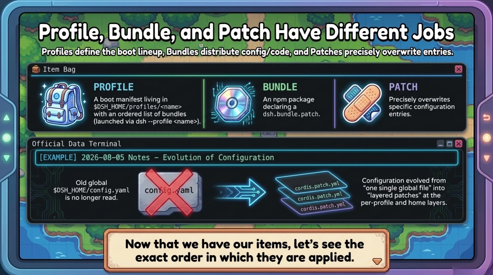
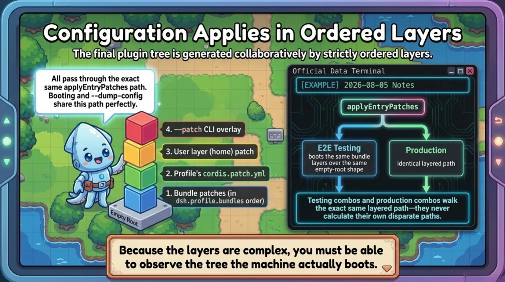
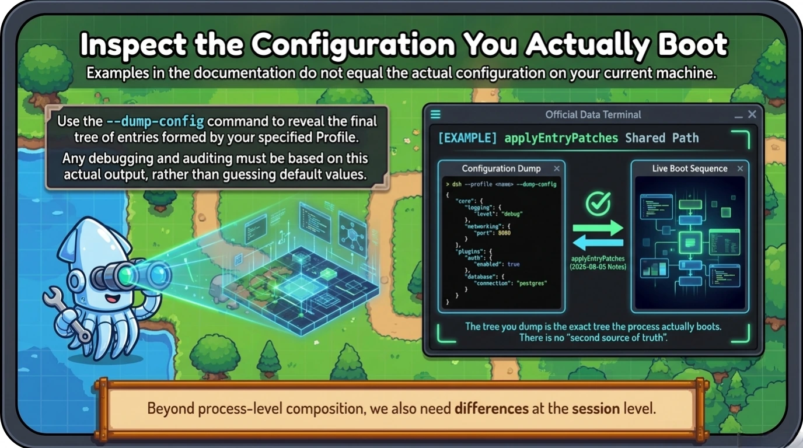
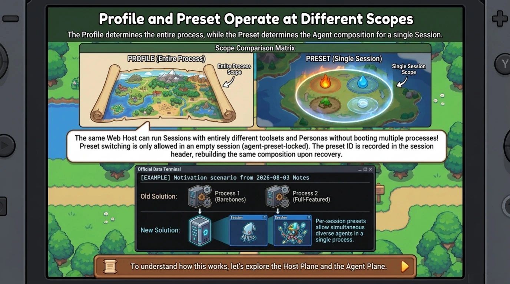
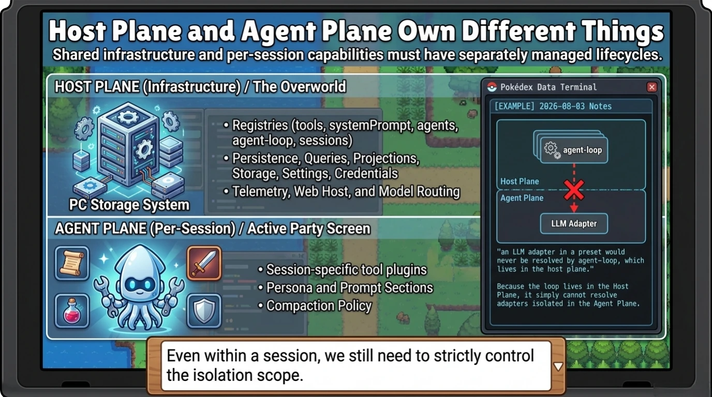
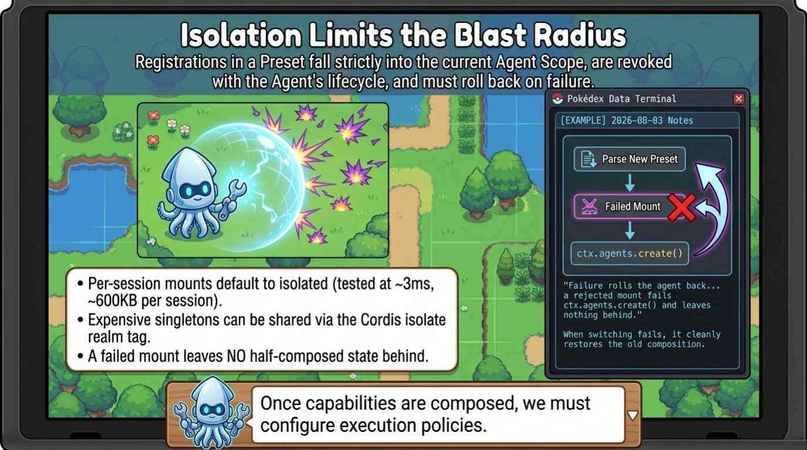
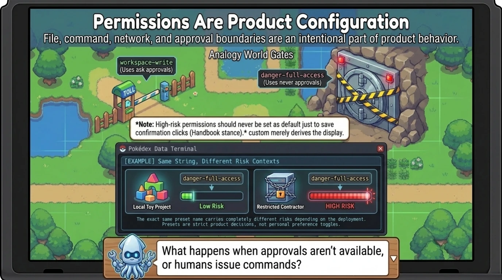
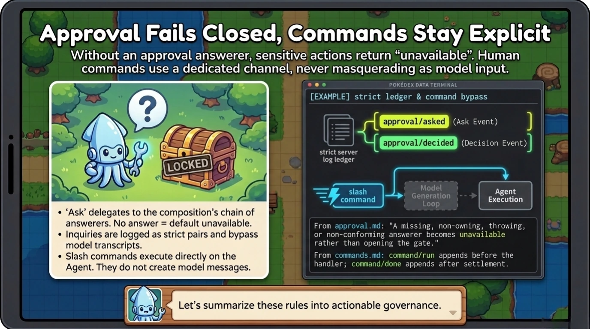
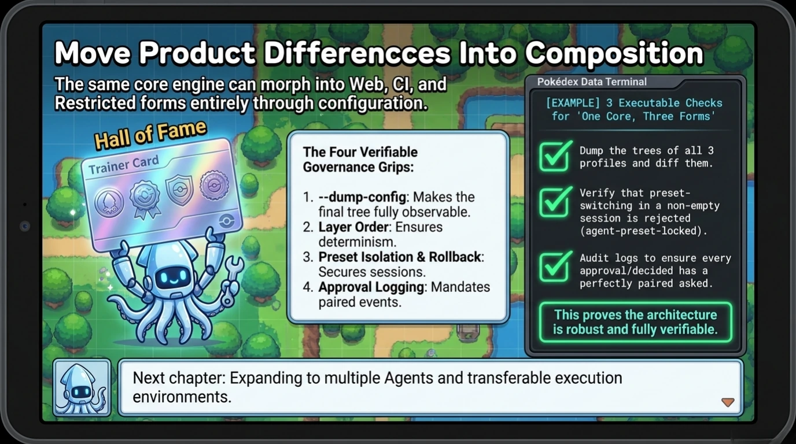

# Chapter 7: Profiles, Presets, and Permissions

[Back to the handbook index](../README.md)

11 visual pages. [View the locked official source map for this chapter.](../SOURCES.md)

[← Previous: Chapter 6](chapter-06.md) · [Handbook index](../README.md) · [Next: Chapter 8 →](chapter-08.md)
