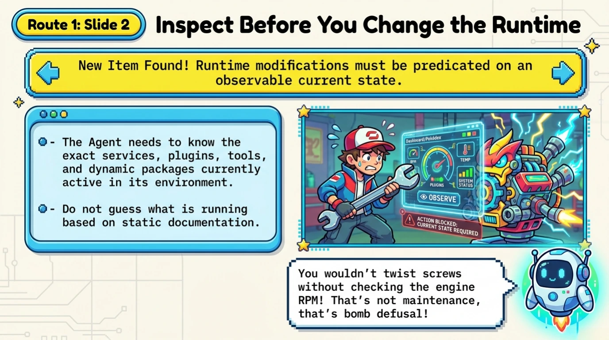
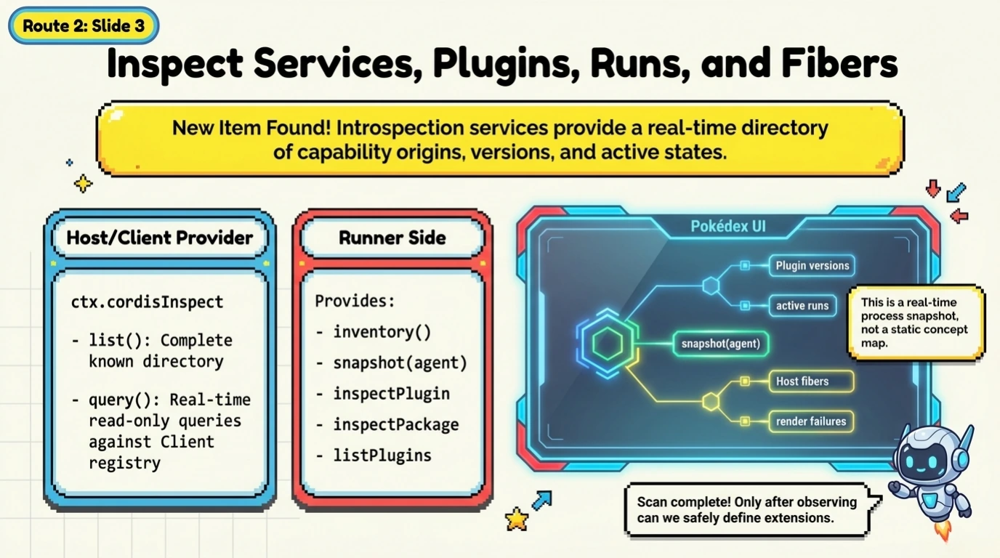
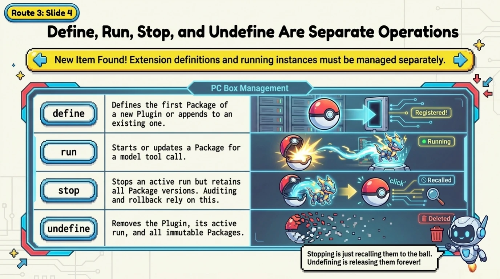
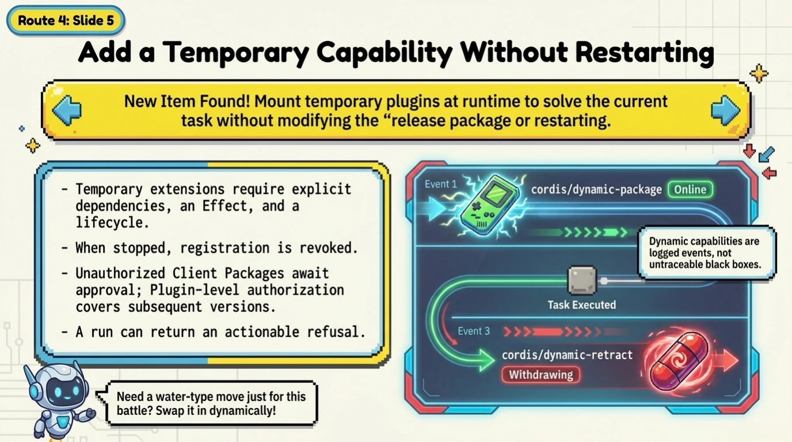
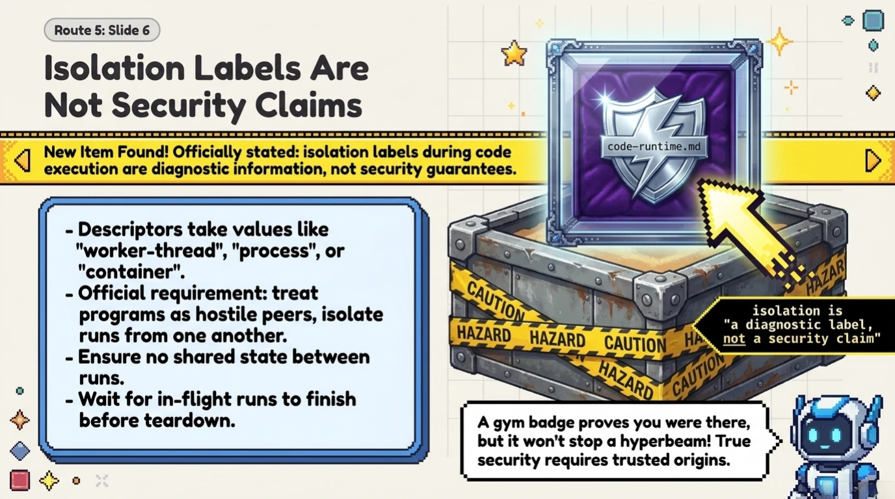
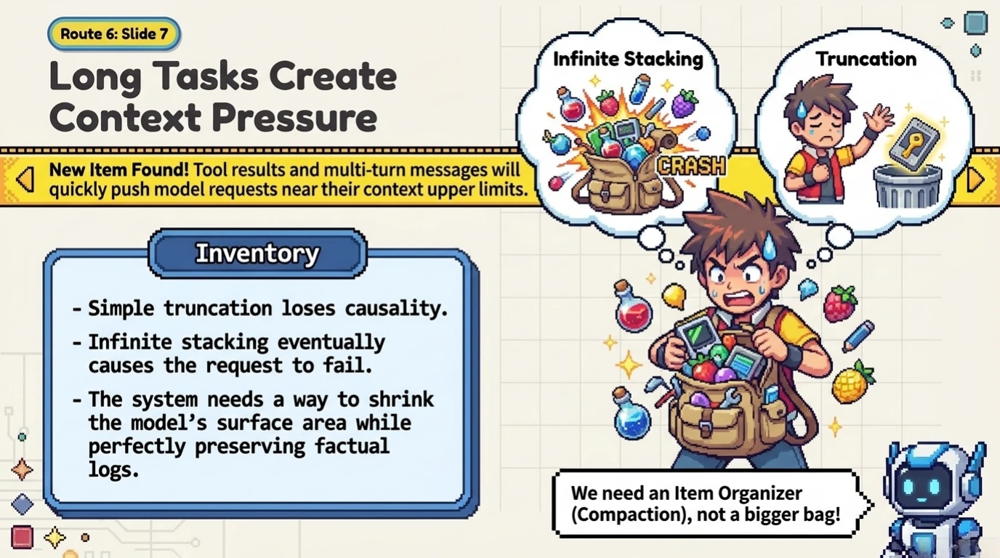
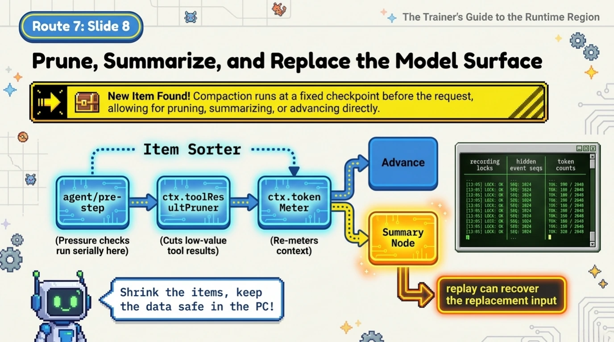
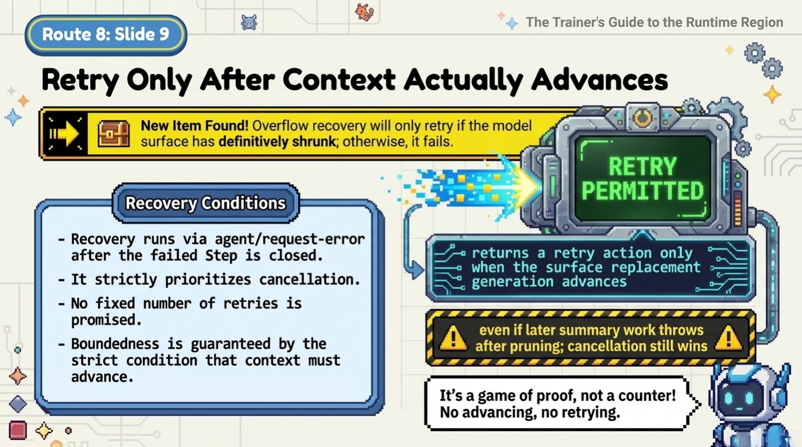
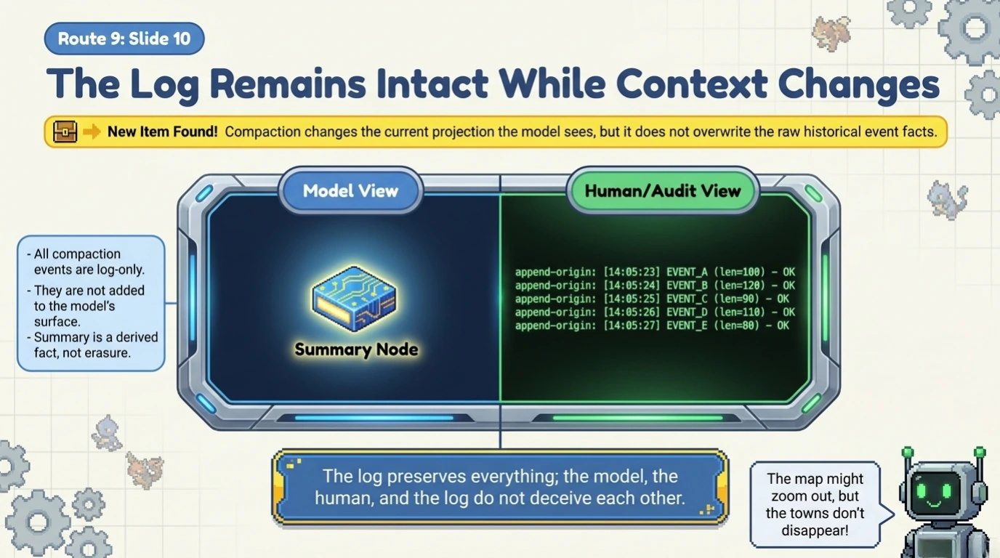
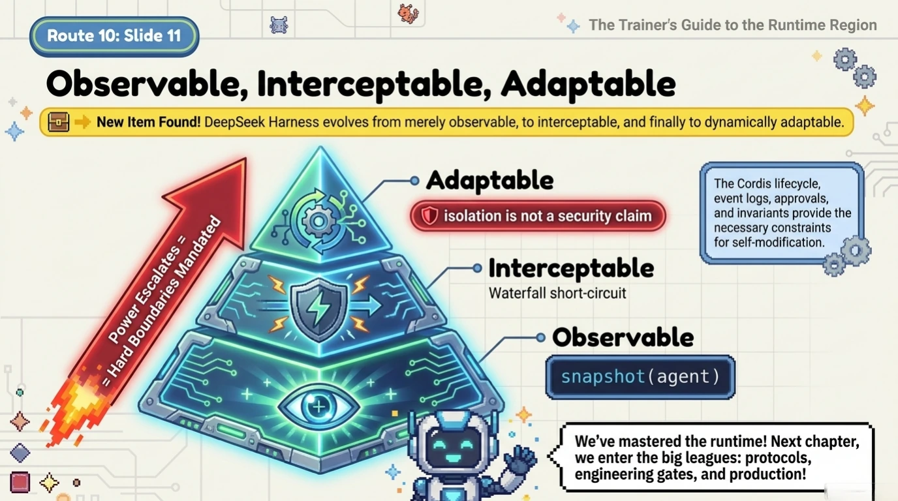

# Chapter 9: Introspection, Runtime Extensions, and Compaction

[Back to the handbook index](../README.md)

11 visual pages. [View the locked official source map for this chapter.](../SOURCES.md)

[← Previous: Chapter 8](chapter-08.md) · [Handbook index](../README.md) · [Next: Chapter 10 →](chapter-10.md)
